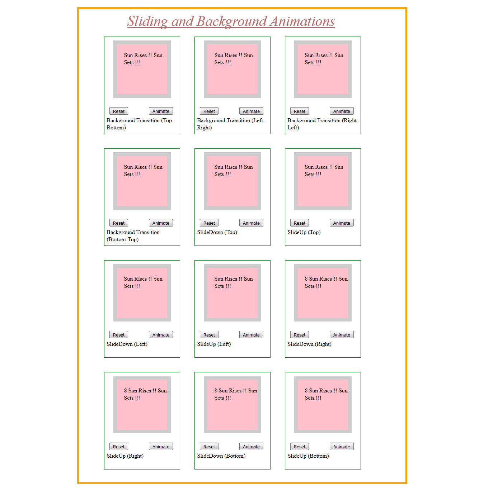

# Background-and-sliding-animations

Created custom directive that can :-<br/>
a) slide down or up, the element in all the 4 directions(top,bottom,left,right).<br/>
b) achieving transition in background application from all the 4 directions(top,bottom,left,right).<br/>

<p align="center">
    
</p>


The component along with the buttons(Reset,Animate) can be reused or alone the component can be reused.

Reset Button   - The Reset Button is used to reset the initial given properties.<br/>
Animate Button - The Animate Button would initiate the related animation.

# View Demo :-
Please [Click here](https://plnkr.co/edit/olWqhcm3Au52CqZpSR50)


 
## Here we have more control on the animation by specifying:-
a) the speed of the animation<br/>
b) percentage of area to be covered in each iteration<br/>


``````````````````````
 Speed of Each Iteration : speed/percentageOfArea
 
````````````````````````````````


 
 


